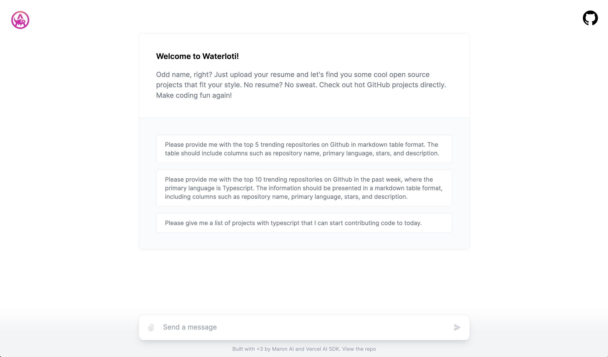

<a href="">
  
  <h1 align="center">Waterloti</h1>
</a>

## Introduction

Meet Waterloti, the quirky-named, open-source AI chatbot. That uses [OpenAI Functions](https://platform.openai.com/docs/guides/gpt/function-calling) and [Vercel AI SDK](https://sdk.vercel.ai/docs), Waterloti smoothly integrates with [Github API](https://github.com/pingcap/ossinsight) for an intuitive, natural language coding experience. Dive in and explore open source like never before!

## Setting Up Locally

To set up Waterloti locally, you'll need to clone the repository and set up the following environment variables:

- `OPENAI_API_KEY` – your OpenAI API key (you can get one [here](https://platform.openai.com/account/api-keys))

## Tech Stack

Waterloti is built on the following stack:

- [Next.js](https://nextjs.org/) – framework
- [OpenAI Functions](https://platform.openai.com/docs/guides/gpt/function-calling) - AI completions
- [Vercel AI SDK](https://sdk.vercel.ai/docs) – AI streaming library
- [Vercel](https://vercel.com) – deployments
- [Turborepo](https://turbo.build/) – build tool
- [TailwindCSS](https://tailwindcss.com/) – styles
- [OSSInsight Public APIs](https://ossinsight.io/docs/api) - Github APIs alternative

## Contributing

Here's how you can contribute:

- [Open an issue](https://github.com/maron-ai/waterloti/issues) if you believe you've encountered a bug.
- Make a [pull request](https://github.com/maron-ai/waterloti/pull) to add new features/make quality-of-life improvements/fix bugs.

## Author

- Dorcy Shema ([@dorcyshema](https://twitter.com/@dorcyshema))
